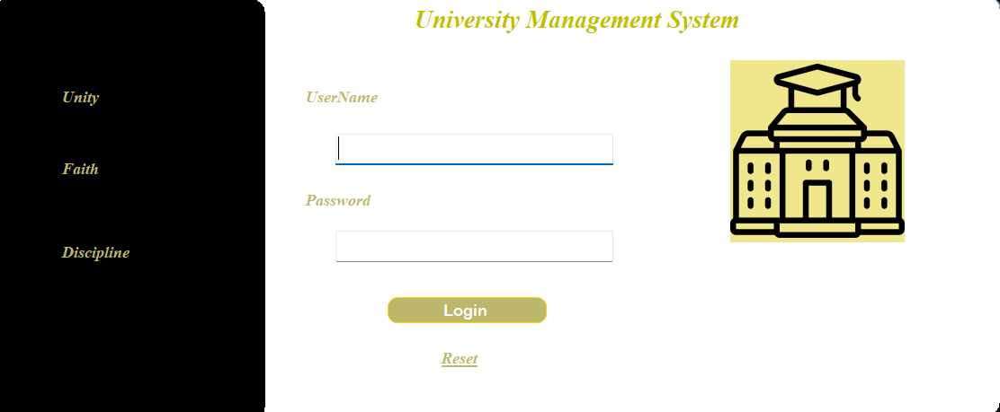

# 📚 University Management System  

[](https://docs.microsoft.com/en-us/dotnet/csharp/)  
[](https://www.microsoft.com/en-us/sql-server)  
[](https://visualstudio.microsoft.com/)  

---

## 📖 Project Overview
The **University Management System** is a desktop application developed using **C# Windows Forms** and a **local SQL Server database**.  
It is designed to automate and simplify university operations such as managing students, teachers, courses, and fees.  

---

## ✨ Features
- 👩‍🎓 **Student Management** – Add, update, delete, and view student details.  
- 👨‍🏫 **Teacher Management** – Manage teacher records and assignments.  
- 📚 **Course Management** – Assign and update courses for students and teachers.  
- 💰 **Fee Management** – Track and update student fee payments.  
- 🔐 **Authentication** – Secure login system for admin access.  
- 📊 **Reports** – View and manage student and course reports.  

---

## 🛠️ Tech Stack
- **Programming Language:** C#  
- **Framework:** Windows Forms (.NET Framework)  
- **Database:** SQL Server (LocalDB)  
- **IDE:** Visual Studio  

---

## 🚀 Installation & Setup
1. **Clone the Repository**
   ```bash
   git clone https://github.com/sxjjad-Mehmood/University-Management-System-.git
   cd university-management-system
2. Open in Visual Studio
   Open the .sln file in Visual Studio.
3. Setup Database
   Attach the provided .mdf SQL Server database file
   Update the connection string in App.config
4. Run the Project
 	  Press F5 or click Start in Visual Studio to run the application.
   ```
---

## 📸 Screenshots
🔑 Login Screen

🏠 Home Dashboard

🏫 Department Management

👩‍🎓 Student Management


---

## 👨‍💻 Author

Sxjjad Mehmood
Project – University Management System


